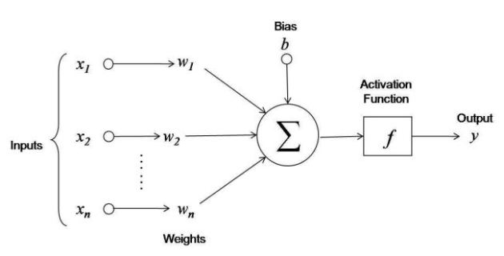
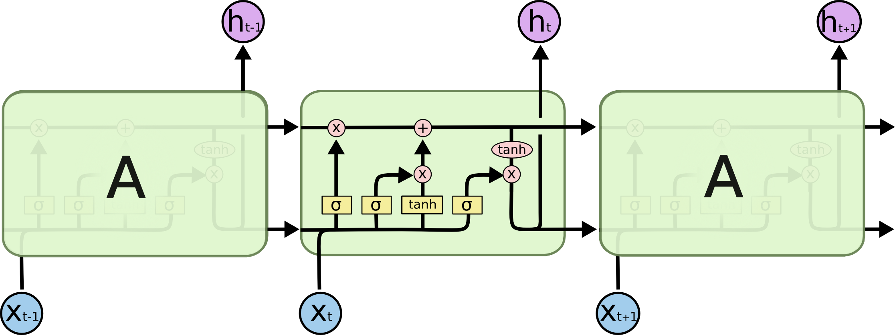
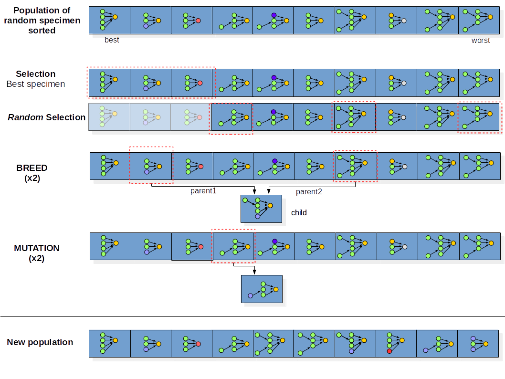

# Implementations of various Models
 

# Table of Contents
1. [Input Reconstruction](#Input Reconstruction)
2. [Toy Example of a LSTM](#Toy Example of a LSTM)
3. [Genetic Algorithm for optimization of a ConvNet architecture](#Genetic Algorithm for optimization of a ConvNet architectur)

-------------
## Input Reconstruction

A walk-through an algorithm to generate an input from an output using gradient descent.

<table style="border=0px solid #000"><tr><td>

</td></tr>
</table>

-------------
## Toy example of a LSTM

Implementation of a Bidirectional LSTM model usign Keras backend.
The model takes as input a date that coudl be in a variety format and convert it into a standard date format.
<table style="border=0px solid #000"><tr><td>

</td></tr>
</table>

--------------
## Genetic Algorithm for optimization of a ConvNet architecture

Implementation of the Genetic algorithm, where the design of Neural Networks are allowed to evolve so that the validation loss is minimized.
The datset used is the cats and dogs dataset from Kaggle. The model is a light-weight VGG16. The feature extractor (Convolutional layers) are kept unchanged, and the fully connected layers ofthe classifier are modified through 4 processes: selection fo best network (lowest validation loss), random selection model, breed and mutation.

<table style="border=0px solid #000"><tr><td>

</td></tr>
</table>

---

*Contact:*
Let me know if you have questions/suggestions. Feel free to connect with me on [LinkedIn](https://www.linkedin.com/in/jmlbeaujour/).